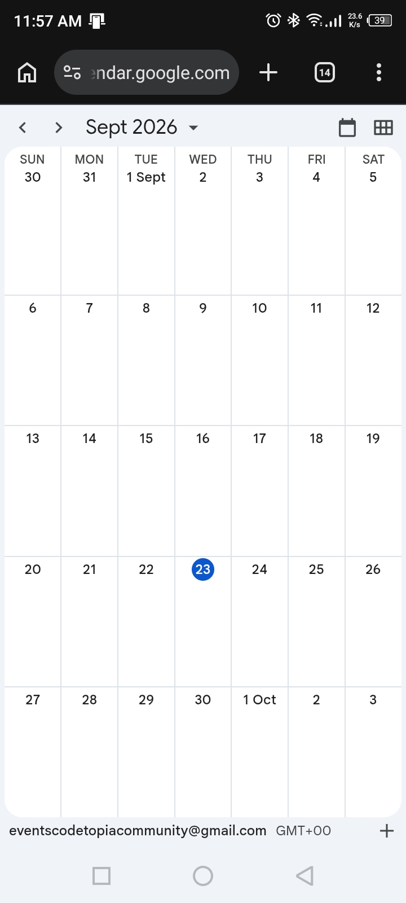
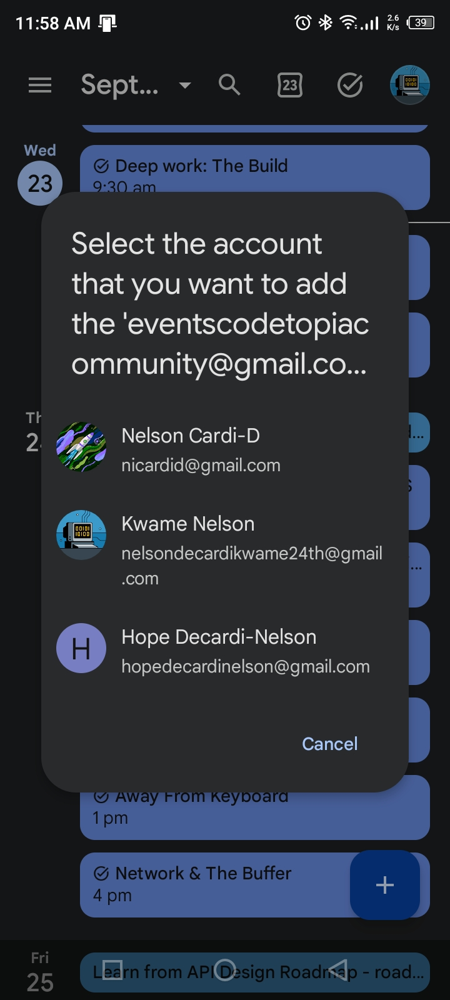
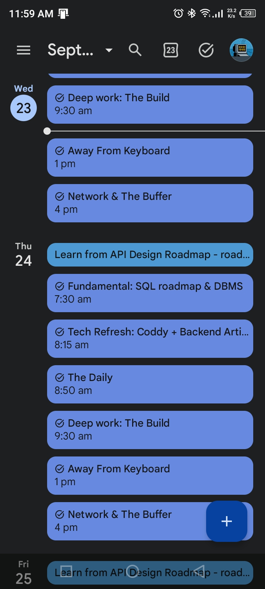
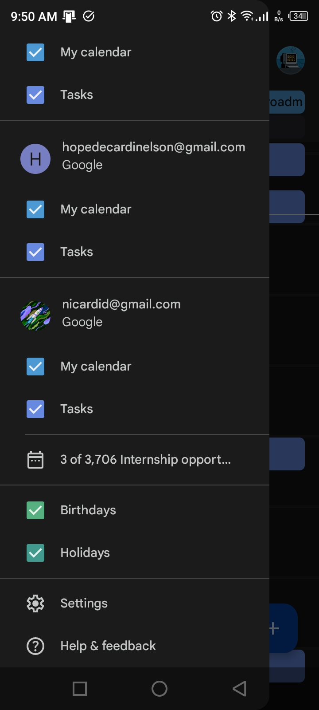
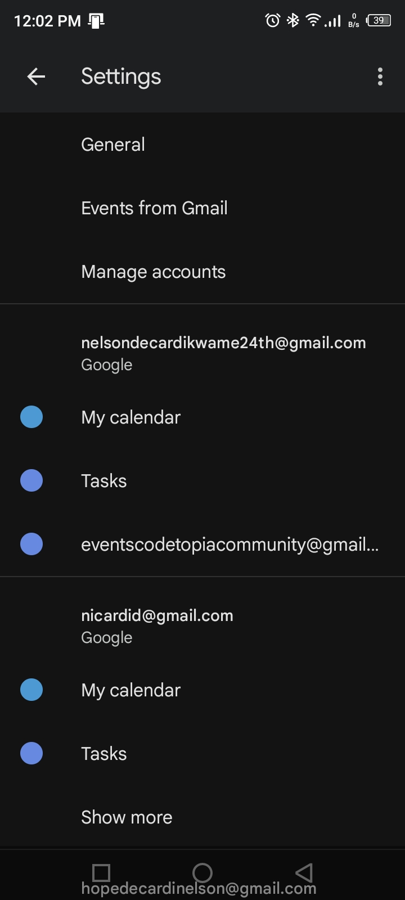
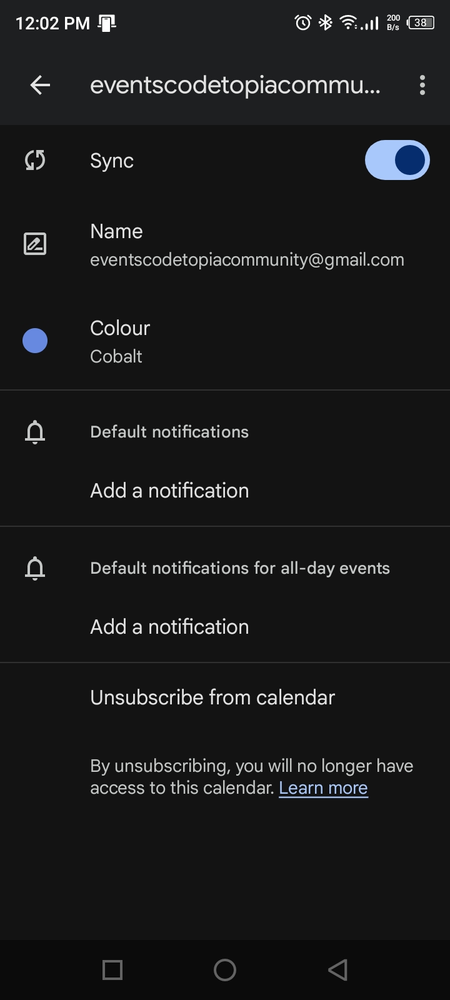

#  📅 Add the Codetopia Community Calendar

Want to see Codetopia Community events, meetings, sessions, and other activities directly on your calendar?

Follow the steps below. Don't worry if you've never used Google Calendar before, we've got you.

---

## Option 1: Google Calendar

1. Click on this link [Codetopia Community calendar](https://example.com)

2. This opens in a browser on your mobile device. 

3. Click on the plus sign at the bottom right corner of the page

4. Your google calendar app on your mobile device will open. Select the account to which you want to subscribe to the codetopiacommunity calendar. 

5. You will receive a message showing codetopiacommunity calendar has been added successfully

6. Next we need to make sure the codetopiacommunity calendar is in sync. This ensures that you get the latest events created by codetopiacommunity to show up in our google calendar.

7. Open the Calendar menu. Look at the top-left corner of the screen. You will see the ☰ menu icon (three horizontal lines). 👉 Tap ☰. A menu will slide out from the side. 

8. Go to Settings. Scroll through the menu until you find Settings. 👉 Tap Settings. This opens the settings for your Google Calendar.

9. Find the Codetopia Community calendar. Inside Settings, look through the calendars listed on your account. Find: Events Codetopia Community 👉 Tap Events Codetopia Community. This opens the settings specifically for the Codetopia Community calendar.

10. Turn on Sync. Look for the Sync option. 👉 Make sure the switch next to Sync is turned ON.

If the switch is already on, you don't need to change anything.

**✅ You're done!**
Go back to your calendar. Codetopia Community events should now appear alongside your personal calendar events.

---
